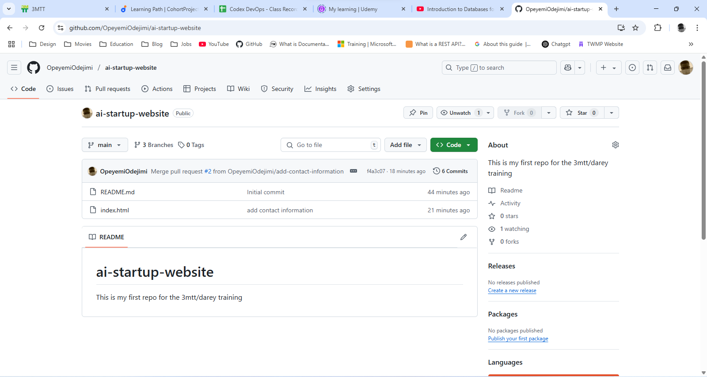
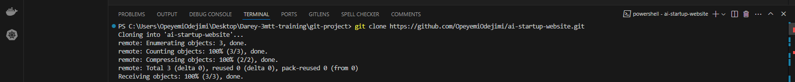
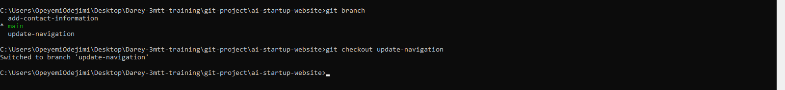
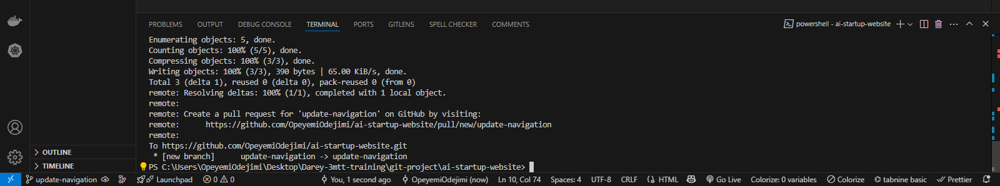
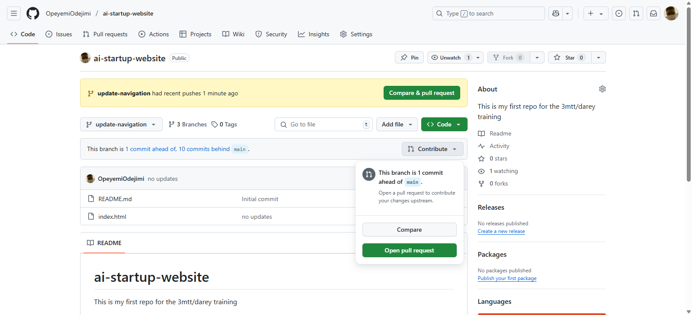
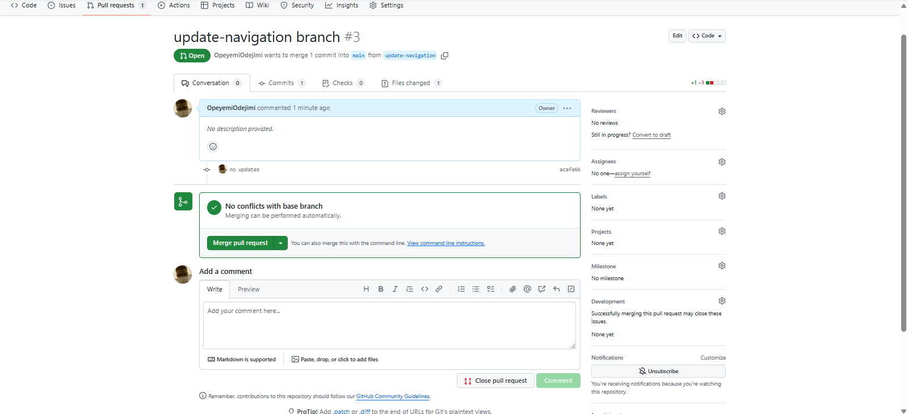
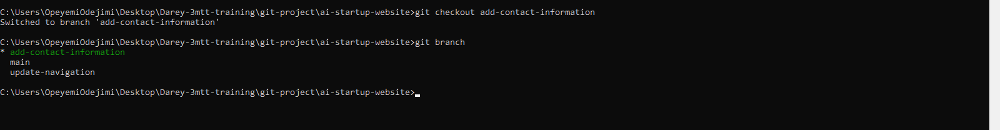
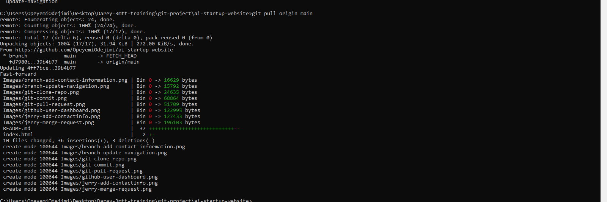

# AI StartUp Project (Git Mini Project)

This project takes learners through the rudiments and importance of **Version Control** and **Version Control Systems** in Software Development. The Project involves two members; Tom and Jerry that make changes to the homepage of a website simultaneously without overwriting each other's work with the help of **Git**

## Conceptualizing Git Set Up with Tom and Jerry

* The first image shows the GitHub User Dashboard

* The second image shows the cloning of the repo using git clone command

* The third image shows Tom switching from the *__main__* branch to the *__update-navigation__* branch

* The fourth image shows Tom working from the *__update-navigation__* branch he created.

* The fifth image shows Tom creating a pull request

* The sixth image shows merging Tom's pull request

* The seventh image shows Jerry switching from the *__main__* branch to the *__add-contact-information__* branch.

* The eighth image shows Jerry pulling changes from the main branch

* The ninth image shows Jerry working from the *__add-contact-information__* branch he created

* The tenth image shows Jerry creating a pull request.

## The link to the index.html file

* **__https://github.com/OpeyemiOdejimi/ai-startup-website/blob/main/index.html__**

## The git commands used

The following git commands were used during the project. These commands were useful as they helped in proper collaboration between Tom and Jerry.

``git branch``

``git checkout -b update-navigation``

``git checkout -b add-contact-info``

``git checkout update-navigation``

``git add index.html``

``git commit -m "commit message"``

``git push origin main``

``git push origin update-navigation``

``git push origin add-contact-info``

``git pull origin main``

## Conclusion

Through this project learners were able to grasp the concept of version control and version control systems. This project demonstrates how Tom and Jerry were able to work on the same file simultaneously without overwriting each other's work. Git tracked their changes, allowing them to merge their updates seamlessly into the main project. This example illustrates the power of using a Version Control System like Git for collaborative ddevelopment.
