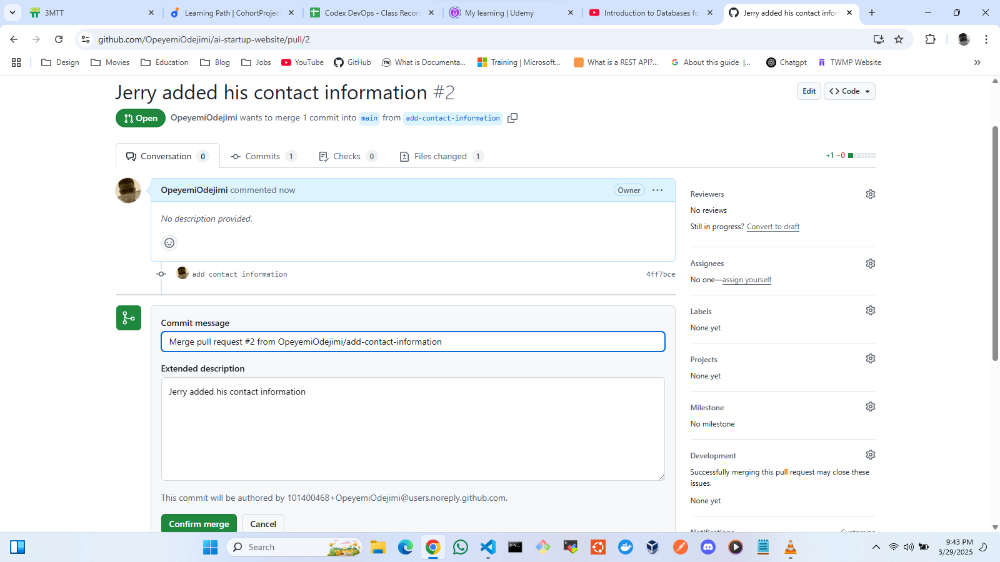
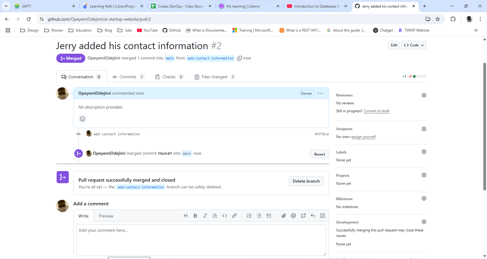

# AI StartUp Project

This project takes learners through the rudiments and importance of **Version Control** and **Version Control Systems** in Software Development. The Project involves two members; Tom and Jerry that make changes to the homepage of a website simultaneously without overwriting each other's work with the help of **Git**

# Conceptualizing Git Set Up with Tom and Jerry

* The first image shows the GitHub User Dashboard

* The second image shows the cloning of the repo using git clone command

* The third image shows Tom working from the **__update-navigation__** branch he created.

* The next image shows Jerry working from the **__add-contact-information__** branch he created

* The next set of images displays the merging of pull requests to the main branch.

# Conclusion

Through this project learners were able to grasp the concept of version control and version control systems. This project demonstrates how Tom and Jerry were able to work on the same file simultaneously without overwriting each other's work. Git tracked their changes, allowing them to merge their updates seamlessly into the main project. This example illustrates the power of using a Version Control System like Git for collaborative ddevelopment.